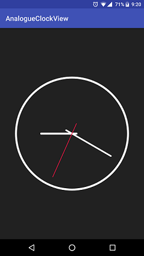

# A customisable analogue clock view for Android.





## Usage

#### Add the view to XML

```xml
 <com.k2.analogueclockview.AnalogueClock
    android:layout_width="match_parent"
    android:layout_height="match_parent" />
```

## Configurable properties

### Set hand width

```java
    // In java
    clockView.setHourHandWidth(15);
    clockView.setMinuteHandWidth(20);
    clockView.setSecondHandWidth(6);
    clockView.setOutlineWidth(10);
```

```xml
    <!-- In XML -->
    app:hour_hand_width="20"
    app:minute_hand_width="12"
    app:second_hand_width="6"
    app:outline_width="10"
```
### Set hand color

```java
    // In java
    clockView.setHourHandColor(Color.BLUE);
    clockView.setMinuteHandColor(Color.BLUE);
    clockView.setSecHandColor(Color.RED);
    clockView.setOutlineColor(Color.BLACK);
```

```xml
    <!-- In XML -->
    app:second_hand_color="@android:color/holo_red_dark"
    app:outline_color="@android:color/holo_orange_dark"
    app:hour_hand_color="@android:color/white"
    app:minute_hand_color="@android:color/white"
```

### Fill color

If true, will fill the outline colour to the full watch face

```java
    // In java
    clockView.setFillBackground(true);
```

```xml
    <!-- In XML -->
    app:fill_background="true"
```
